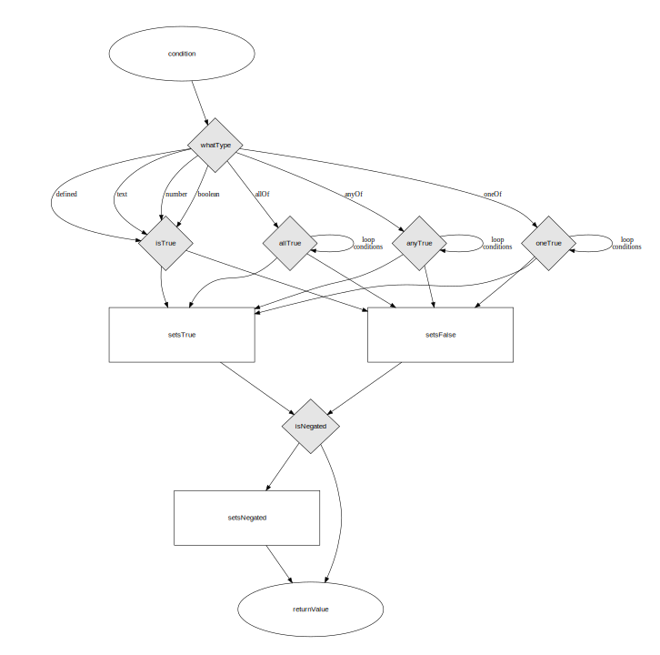

Conditions are a fundamental building block

They provide the mechanism that determines

- whether to show an element or page
- whether a redirect specified by nextPage should take place
- whether a control should be disabled

A condition can be either:

- a single expression or
- a group of conditions
  - that must all evaluate to true
  - of which at least one must evaluate to true
  - of which only one can evaluate to true

(this is similar to allOf, anyOf and oneOf in JSON Schema)

Whether a condition evaluates to true or not can be seen in the following diagram.

