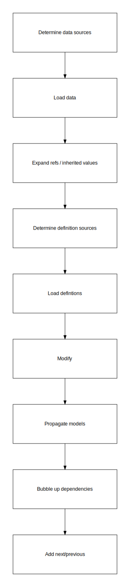
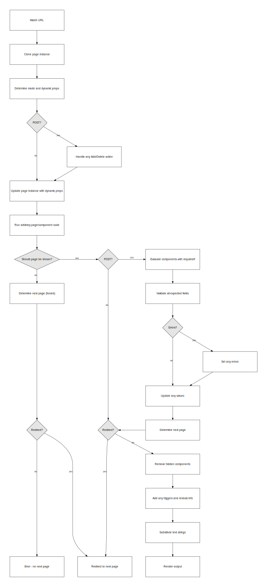

About the runner

- Determine data sources
- Load data
- Expand refs / inherited values
- Determine definition sources
- Load defintions
- Modify
- Propagate models
- Bubble up dependencies
- Add next/previous

